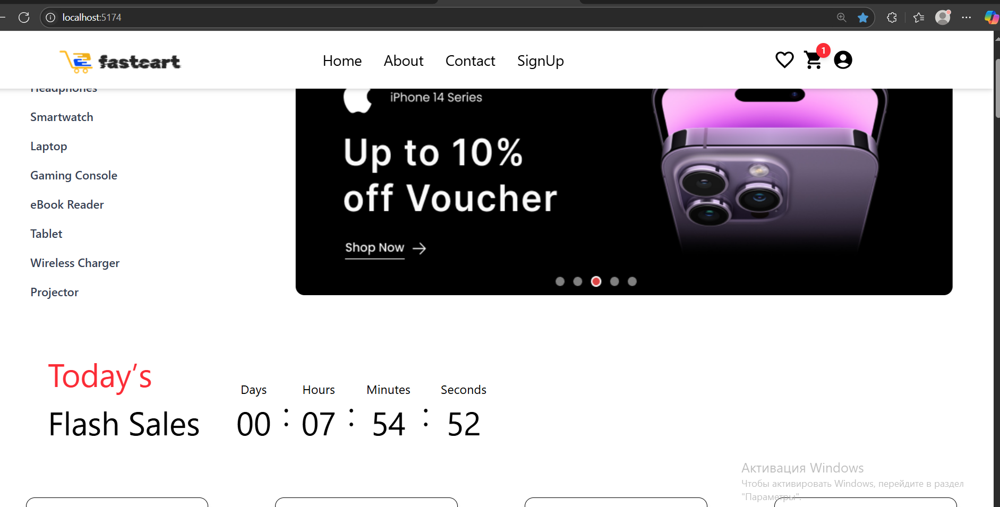
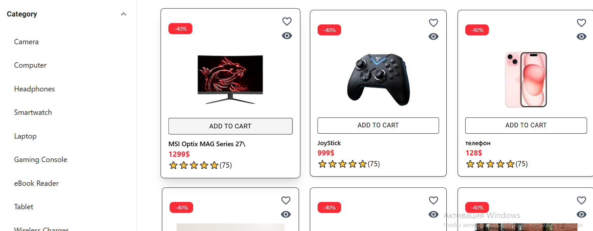

# 📱 FastCard
FastCard — это удобный и современный веб-сайт для покупки смартфонов, наушников, iPhone и других гаджетов. Проект создан с нуля с целью сделать процесс покупки техники быстрым и комфортным для пользователей.
---
## 🚀 О проекте
**FastCard** — это:
- Чистый и интуитивный интерфейс
- Быстрая корзина покупок
- Современный дизайн с использованием Tailwind CSS
- Простое добавление и удаление товаров
- Управление состоянием с помощью Redux
- Полностью адаптивный интерфейс
## Проект разрабатывался мной в течение **7 дней**, и я вложил в него максимум старания, чтобы он был удобным и красивым.
## ✅ Основные функци
- 🔍 Удобный поиск и фильтрация товаров
- 🛒 Мгновенное добавление товаров в корзину
- 💰 Подсчёт общей стоимости корзины
- 📱 Полностью адаптивный дизайн — удобно с телефона и компьютера
- ⚡ Быстрая загрузка страниц благодаря React и Vite
- 🔄 Простое управление состоянием с Redux
- 🎨 Гибкий и красивый интерфейс на Tailwind CSS

## 📢 Обратная связь

Если у вас есть предложения, замечания или баги — пожалуйста, создайте `Issue` или напишите мне!  
Любая обратная связь помогает сделать FastCard лучше.



## 🛠️ Используемые технологии

- ⚛️ **React** — библиотека для построения пользовательских интерфейсов
- 🗂️ **Redux** — управление состоянием приложения
- 🎨 **Tailwind CSS** — быстрая и удобная стилизация компонентов
- 📦 **Vite** (если ты использовал) — для быстрого старта разработки (если нужно,

## ⚙️ Установка и запуск

> Если твой проект можно запустить локально, добавь инструкции:

```bash
https://github.com/ParvizSodatov/FastCart-onlineStore.git

## 🔥 Бекенд проекта (C# / ASP.NET Core)

Для обработки данных, управления товарами и заказами в FastCard используется бекенд, написанный на C# с использованием **ASP.NET Core**.

### Основные возможности бекенда:

- 📦 Управление каталогом товаров (создание, обновление, удаление)
- 🛒 Обработка корзины и заказов
- 🔐 Авторизация и аутентификация пользователей (планируется)
- 📊 API для взаимодействия с фронтендом (RESTful)
- ⚙️ Подключение к базе данных (например, SQL Server или SQLite)

### Запуск бекенда:

1. Открыть проект бекенда в Visual Studio или VS Code
2. Настроить подключение к базе данных в файле `appsettings.json`
3. Выполнить миграции базы данных (если применимо)
4. Запустить проект (например, `dotnet run`)
5. API будет доступен по адресу `http://localhost:5000/api/...`

### Интеграция с фронтендом:

- Фронтенд отправляет запросы к API бекенда для получения списка товаров, добавления товаров в корзину и оформления заказа
- Все данные хранятся и обрабатываются на сервере
---

Если хочешь, могу помочь написать базовый шаблон проекта ASP.NET Core Web API для твоего бекенда или даже описать, как связать фронтенд с этим API.
Структура Проэкта
FastCard/
├── public/          # Публичные файлы
├── src/
│   ├── components/  # Компоненты React
│   ├── pages/       # Страницы сайта
│   ├── store/       # Redux store
│   ├── styles/      # Стили Tailwind (если есть)
│   ├── App.jsx
│   └── main.jsx
├── package.json
└── README.md
👨‍💻 Автор
Парвиз Содатов
📜 Лицензия
На данный момент лицензия не выбрана.
💡 Если ты хочешь, я могу помочь выбрать подходящую лицензию (например, MIT или GNU).
🙏 Благодарности
Спасибо всем, кто вдохновляет и поддерживает меня в разработке!
Особая благодарность — Устод Начибулло, Redux и Tailwind CSS за мощные инструменты для фронтенда.
📅 Планы на будущее
🔄 Добавить регистрацию и авторизацию пользователей

💳 Интегрировать оплату онлайн

📦 Подключить реальный каталог товаров и бэкенд

📈 Оптимизировать производительность

🌐 Развернуть сайт в продакшн


```
